<div align="center">

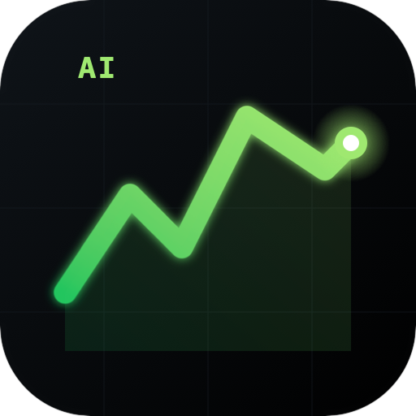

# AI Trading Agent

**Multi-symbol autonomous trading platform powered by Claude AI agents**

Trades **GOLD** · **OILCash** · **BTCUSD** · **USDJPY** through MetaTrader 5

[](https://www.python.org/)
[](https://fastapi.tiangolo.com/)
[](https://nextjs.org/)
[](https://www.postgresql.org/)
[](https://redis.io/)
[](https://www.anthropic.com/)
[](https://railway.app/)
[]()

[Features](#-features) · [Screenshots](#-screenshots) · [Architecture](#-architecture) · [Quick Start](#-quick-start) · [Pages](#-pages-overview)

</div>

---

## ✨ Highlights

> Eight specialist Claude agents collaborating on a virtual trading floor — Orchestrator, Technical, Fundamental, Risk, Reflector, Sentiment, Strategy Optimizer, and Single-Agent fallback. Hard guardrails prevent runaway trades. Real-time UI streams every decision, position, and P&L tick.

<div align="center">


</div>

---

## 📑 Table of Contents

- [Features](#-features)
- [Screenshots](#-screenshots)
- [Architecture](#-architecture)
- [Tech Stack](#-tech-stack)
- [Pages Overview](#-pages-overview)
- [Quick Start](#-quick-start)
- [Project Structure](#-project-structure)
- [Environment Variables](#-environment-variables)

---

## 🚀 Features

| Domain | Capability |
|--------|-----------|
| 🧠 **Multi-Agent AI** | 8 specialist Claude agents (Sonnet + Haiku) — Orchestrator + Technical + Fundamental + Risk + Reflector + Sentiment + Optimizer |
| 🛡️ **Guardrails** | Non-bypassable limits at MCP tool layer (lot size, daily loss, trade frequency, cooldowns) |
| 🎯 **Strategy Engine** | 5 strategies + ensemble (EMA, RSI, Breakout, Mean Reversion, ML Signal) with regime-adaptive switching |
| 🤖 **ML Models** | Per-symbol LightGBM with 40+ features, drift detection, auto-retrain, calibration analysis |
| 📊 **Real-time Dashboard** | Live ticks, positions, P&L, equity chart, AI insights, multi-symbol tabs |
| 🪙 **Token Cost Tracking** | Per-agent token + cost monitoring with daily breakdown and 90-day retention |
| 🔐 **Secrets Vault** | AES-256-GCM encrypted credential storage, OAuth token health monitor |
| 📰 **News & Sentiment** | RSS + macro feeds, Claude sentiment analyzer with bullish/bearish/neutral scoring |
| ⚖️ **Quantitative Analysis** | VaR, Sharpe, Sortino, drawdown, Monte Carlo, walk-forward, cointegration |
| 🚦 **Gradual Rollout** | Shadow → Paper → Micro-Live → Live deployment modes |
| 🔁 **Self-Reflection** | Reflector agent reviews past trades and writes lessons to session memory |
| 📡 **Live WebSocket** | Real-time price, position, sentiment, and bot event streaming |
| 🔑 **Passkey Auth** | WebAuthn-ready (currently JWT/password active on Railway) |
| 📨 **Telegram Alerts** | Trade open/close, signal, AI analysis, system health (Thai language) |

---

## 📸 Screenshots

> Drop PNGs into `docs/screenshots/` with the filenames below.

### 🏠 Dashboard — Live Trading View
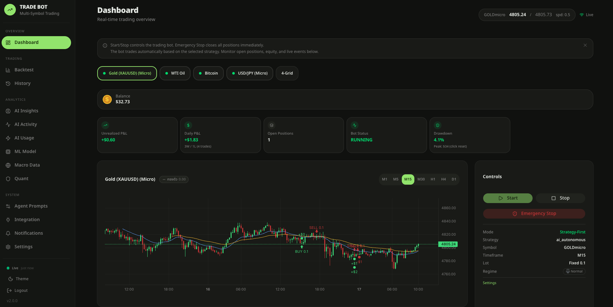

### 📈 Backtest Studio
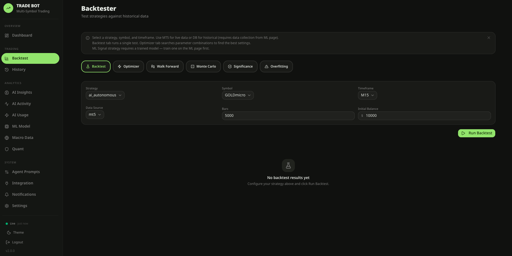

### 📜 Trade History & Performance
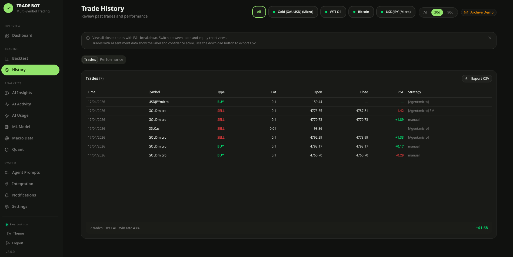

### 🧠 AI Insights
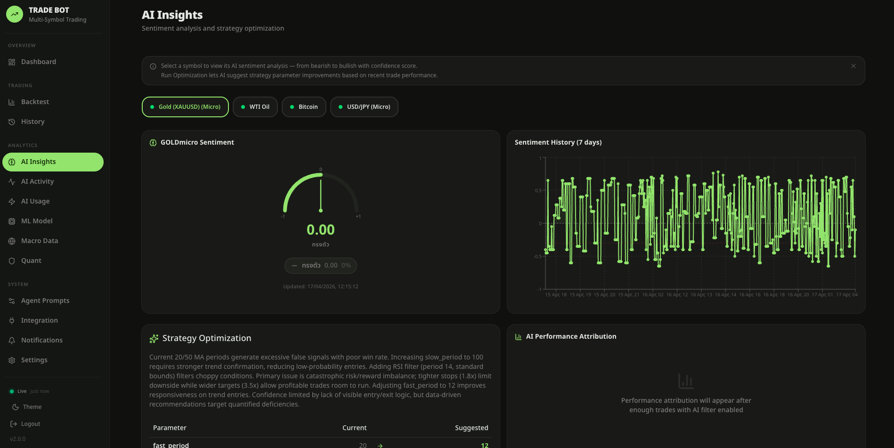

### ⚡ AI Activity Timeline
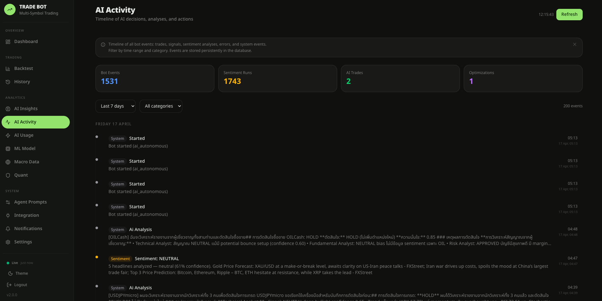

### 💰 AI Usage & Cost Monitor
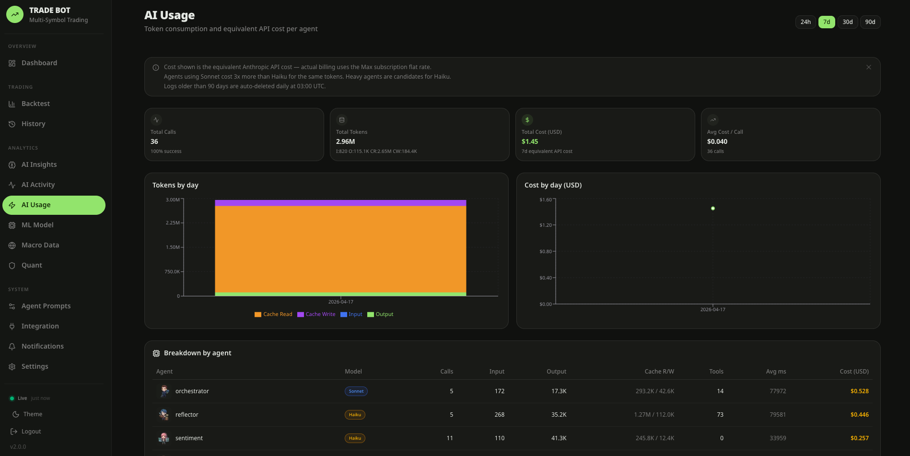

### 🤖 ML Model Monitoring
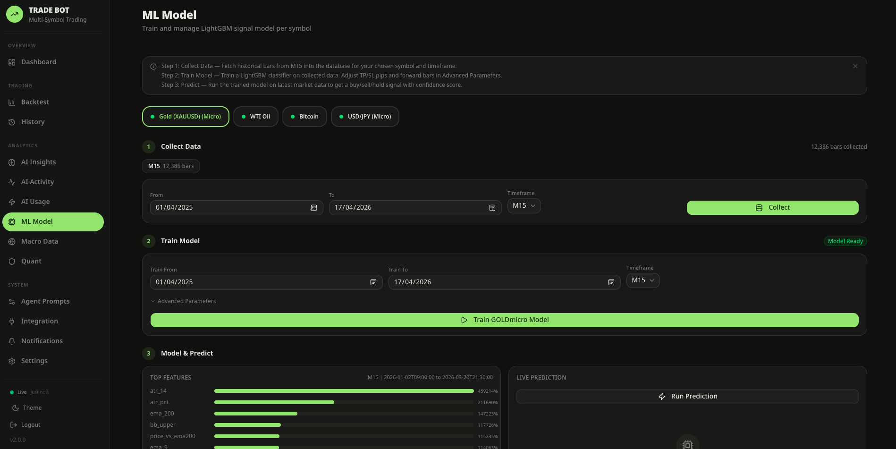

### 🌐 Macro Data
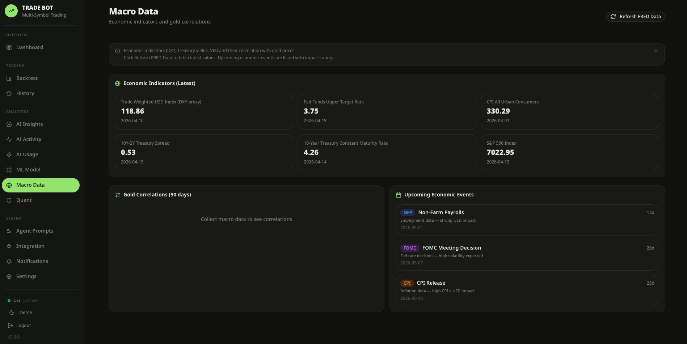

### 🛡️ Quant Risk Dashboard
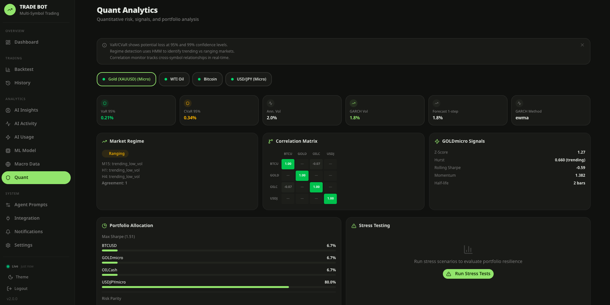

### 🏢 AI Trading Floor — Agent Prompts
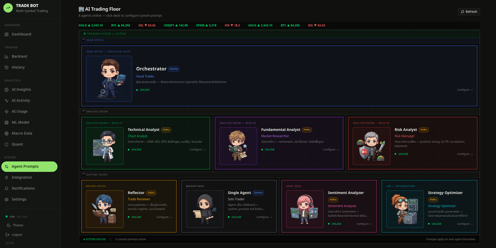

### 🔌 Integration Status
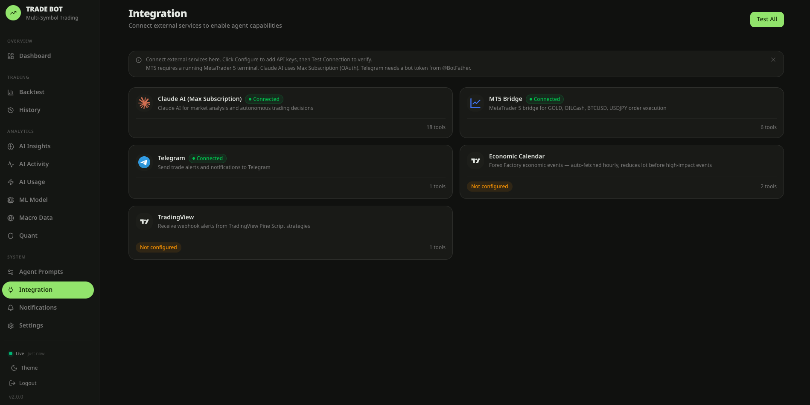

### 🔔 Notifications Center
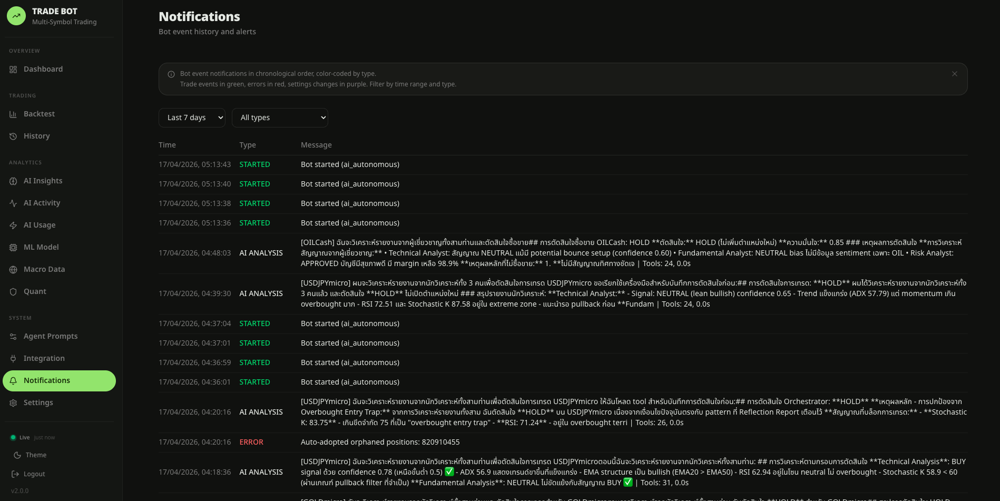

### ⚙️ Settings
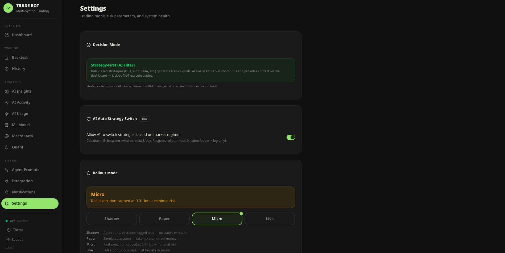

---

## 🏗 Architecture

```
┌──────────────────────────────────────────────────────────────────────┐
│  Frontend (Next.js 16, Vercel/Railway)                               │
│  Dashboard · Backtest · History · AI Insights · AI Usage · ML        │
└──────────────────────┬───────────────────────────────────────────────┘
                       │  HTTPS + WebSocket
                       ▼
┌──────────────────────────────────────────────────────────────────────┐
│  Backend (FastAPI, Railway)                                          │
│  ├── Auth Layer (JWT cookie · Passkey WebAuthn ready)                │
│  ├── Secrets Vault (AES-256-GCM · HKDF key derivation)               │
│  ├── Runner Manager (process / Docker sandbox)                       │
│  │   ├── Job Queue (Redis + DB-persisted)                            │
│  │   ├── Heartbeat Monitor (auto-restart)                            │
│  │   └── Agent Entrypoint (asyncio loop)                             │
│  │       ├── MCP Tool Server (14 modules · 40+ tools)                │
│  │       ├── Guardrails (non-bypassable trading limits)              │
│  │       └── Multi-Agent Pipeline                                    │
│  │           ├── Reflector (Haiku)        — past trade review        │
│  │           ├── Technical Analyst (Haiku) — indicators              │
│  │           ├── Fundamental Analyst (Haiku) — sentiment             │
│  │           ├── Risk Analyst (Haiku)     — portfolio risk           │
│  │           ├── Sentiment Analyzer (Haiku) — news scoring           │
│  │           ├── Strategy Optimizer (Haiku) — param tuning           │
│  │           └── Orchestrator (Sonnet)    — final decision           │
│  ├── Strategy Engine (5 strategies + ensemble + MTF + regime)        │
│  ├── ML Models (LightGBM per-symbol · drift detection)               │
│  ├── AI Usage Logger (token + cost per call · 90d retention)         │
│  ├── PostgreSQL 15 + Redis 7 (AOF persistence)                       │
│  └─── HTTP ────► Windows VPS                                         │
│                  └── MT5 Bridge + MetaTrader 5 (XM Global)           │
└──────────────────────────────────────────────────────────────────────┘
```

---

## 🛠 Tech Stack

| Layer | Technology |
|-------|-----------|
| **Backend** | FastAPI 0.115 · SQLAlchemy 2.0 (async) · asyncpg · APScheduler |
| **Frontend** | Next.js 16 · React 19 · Tailwind 4 · Zustand · lightweight-charts · recharts |
| **AI** | Claude Code SDK (Max subscription) + Anthropic SDK fallback · Sonnet 4 + Haiku 4.5 |
| **ML** | LightGBM · scikit-learn · pandas · 40+ features per symbol |
| **Auth** | JWT Bearer (active) · WebAuthn Passkey (ready) |
| **Trading** | MetaTrader 5 via custom HTTP Bridge (Windows VPS) |
| **CI/CD** | GitHub Actions (ruff · pytest · tsc · build) · Railway auto-deploy |
| **DB** | PostgreSQL 15 (14 Alembic migrations) · Redis 7 (AOF) |
| **Notifications** | Telegram bot (trade signals · AI analysis · system alerts) |
| **Testing** | pytest (444 tests · 27 files) · SQLite in-memory · fakeredis · MT5 mock |

---

## 📄 Pages Overview

| Route | Page | Purpose |
|-------|------|---------|
| `/dashboard` | Trading Dashboard | Live ticks, positions, P&L, equity chart, AI insights, multi-symbol tabs |
| `/backtest` | Backtest Studio | Run backtests, optimizer, walk-forward, Monte Carlo, overfitting score |
| `/history` | Trade History | Past trades + performance breakdown (P&L, equity curve, archive demo) |
| `/insights` | AI Insights | News sentiment + Claude optimization reports |
| `/activity` | AI Activity | Unified timeline of agent decisions, sentiment runs, errors |
| `/ai-usage` | AI Usage | Per-agent token consumption + equivalent USD cost (90-day window) |
| `/ml` | ML Model | LightGBM training, drift detection, calibration, predictions |
| `/macro` | Macro Data | FRED indicators, economic calendar, correlations |
| `/quant` | Quant Risk | VaR, regime, correlation matrix, volatility, portfolio, stress test |
| `/agent-prompts` | Trading Floor | Customize per-agent system prompts (chibi character avatars) |
| `/integration` | Integration | Service connectivity status (DB, Redis, MT5, Vault, OAuth) |
| `/notifications` | Notifications | Event history with filters |
| `/settings` | Settings | Per-symbol risk, AI filter toggle, paper trade switch |
| `/login` | Login | Passkey or password authentication |
| `/setup` | Setup | First-time passkey registration wizard |

---

## ⚡ Quick Start

### Prerequisites

- Python 3.12+
- Node.js 22+
- Docker (for local PostgreSQL + Redis)
- Windows VPS with MetaTrader 5 (production trading only)

### 1. Start databases

```bash
docker-compose up -d
```

### 2. Backend

```bash
cd backend
python -m venv .venv
source .venv/bin/activate          # Windows: .venv\Scripts\activate
pip install -r requirements.txt
cp .env.example .env
alembic upgrade head
uvicorn app.main:app --reload --port 8000
```

### 3. MT5 Bridge (Windows VPS only)

```bash
cd mt5_bridge
pip install -r requirements.txt
cp .env.example .env                # add MT5 credentials
uvicorn main:app --host 0.0.0.0 --port 8001
```

### 4. Frontend

```bash
cd frontend
npm install
cp .env.example .env.local
npm run dev
```

### 5. Run tests

```bash
cd backend
python -m pytest tests/ -v --no-cov   # 444 tests
```

---

## 📁 Project Structure

```
gold-trading-bot/
├── backend/
│   ├── app/
│   │   ├── api/routes/         # 80+ REST endpoints
│   │   ├── ai/                 # Claude client, pricing, usage logger
│   │   ├── bot/                # Trading engine, scheduler, health monitor
│   │   ├── strategy/           # 5 strategies + ensemble + regime
│   │   ├── risk/               # Risk manager, circuit breaker, correlation
│   │   ├── ml/                 # LightGBM trainer, features, drift
│   │   ├── runner/             # Docker sandbox runner system
│   │   ├── db/                 # SQLAlchemy models + 15 migrations
│   │   └── ...
│   ├── alembic/versions/       # DB migrations
│   ├── mcp_server/
│   │   ├── server.py           # FastMCP tool server
│   │   ├── guardrails.py       # Non-bypassable trading limits
│   │   ├── agents/             # 6 specialist agents + orchestrator
│   │   └── tools/              # 14 tool modules
│   └── tests/                  # 444 tests (27 files)
├── frontend/
│   ├── app/                    # Next.js App Router (15 pages, no runners)
│   ├── components/             # UI primitives + layout
│   ├── lib/                    # API client + WebSocket
│   └── public/agent-characters/ # Chibi agent portraits
├── mt5_bridge/                 # MetaTrader 5 HTTP bridge (Windows VPS)
├── agent-character/            # Source character art (PNG)
├── docs/
│   ├── logo/                   # Logo assets
│   └── screenshots/            # README screenshots
├── scripts/backup_db.sh        # Daily pg_dump
└── docker-compose.yml
```

---

## 🔧 Environment Variables

See [`backend/.env.example`](backend/.env.example) and [`mt5_bridge/.env.example`](mt5_bridge/.env.example).

| Variable | Purpose |
|----------|---------|
| `DATABASE_URL` / `DATABASE_URL_SYNC` | PostgreSQL connection (asyncpg + sync for Alembic) |
| `REDIS_URL` | Redis connection |
| `SECRET_KEY` | JWT signing key |
| `VAULT_MASTER_KEY` | AES-256-GCM root key for Secrets Vault |
| `CLAUDE_CODE_OAUTH_TOKEN` | Claude Max subscription token |
| `MT5_BRIDGE_URL` / `MT5_BRIDGE_API_KEY` | Windows VPS bridge endpoint |
| `AGENT_MODE` | `single` (Phase C) or `multi` (Phase D) |
| `ROLLOUT_MODE` | `shadow` · `paper` · `micro` · `live` |
| `MAX_RISK_PER_TRADE` / `MAX_DAILY_LOSS` / `MAX_LOT` | Hard risk limits |
| `TELEGRAM_BOT_TOKEN` / `TELEGRAM_CHAT_ID` | Telegram alerts |

---

## 📜 License

Private — internal use only.

---

<div align="center">

Built with **Claude Code** · Deployed on **Railway** · Trading on **MT5**

</div>
